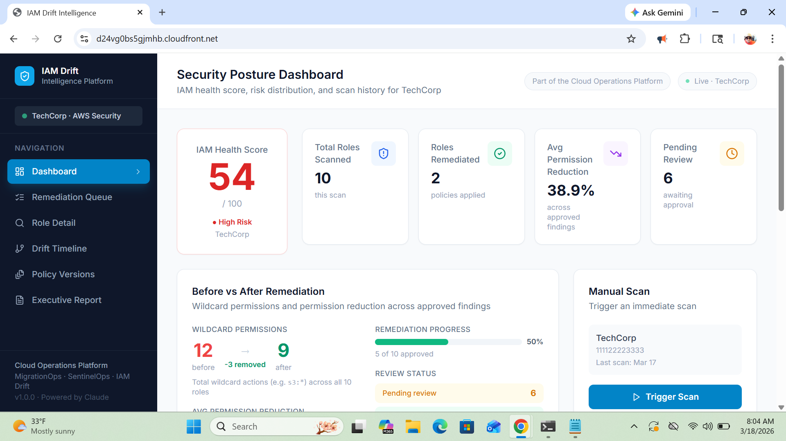
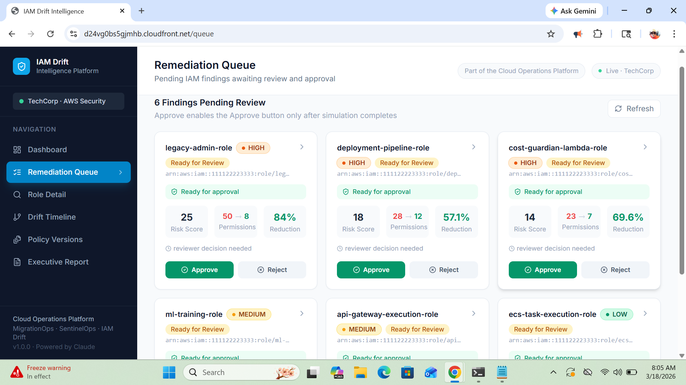
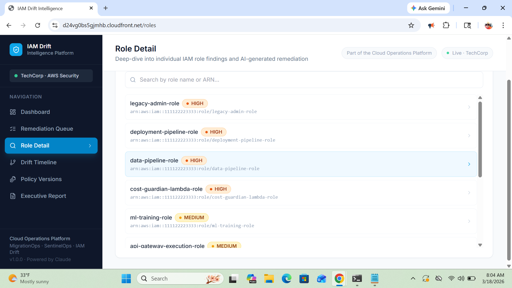

# IAM Drift Intelligence

Enterprise IAM least-privilege remediation platform for AWS Organizations.

Detects over-permissioned roles, generates AI-assisted replacement policies, validates them using IAM Policy Simulator, and tracks permission drift over time — with human-approved, rollback-ready changes.

**Reduced effective IAM permissions by 38.9% across 10 IAM roles with zero service disruption.**

---

## Live Demo

| | |
|---|---|
| **Frontend** | https://d24vg0bs5gjmhb.cloudfront.net |
| **API** | https://p6oiquka77.execute-api.us-east-1.amazonaws.com/prod/api/dashboard/metrics |

Loads with TechCorp demo environment — 10 pre-assessed IAM roles. Account IAM Health Score: 54/100.

Demo environment uses a seeded multi-account dataset representing enterprise IAM conditions and remediation workflows.

---

## The Problem

IAM is the most misconfigured layer in AWS — and the hardest to fix safely.

Most teams:
- Know roles are over-permissioned
- Lack usage visibility to safely reduce access
- Avoid making changes due to risk of breaking production

Existing tools stop at detection: flag wildcards, generate reports, leave remediation to engineers. That gap creates long-lived security risk.

---

## The Solution

IAM Drift Intelligence closes the remediation gap by combining:
- Deterministic IAM policy analysis
- CloudTrail usage evidence
- AI-assisted least-privilege policy generation
- IAM Policy Simulator validation
- Human-approved, rollback-ready changes

**Detection is table stakes. This is the remediation layer.**

---

## Business Impact

- Reduces excessive permissions before they become privilege-escalation paths
- Eliminates manual IAM cleanup and guesswork
- Provides simulation-validated remediation before changes are applied
- Enables auditable, reversible IAM changes
- Tracks permission drift across multi-account AWS environments

---

## Why It's Different

| Most IAM Tools | IAM Drift Intelligence |
|---|---|
| Detect risky permissions | Detects excessive access deterministically |
| Generate static reports | Uses real CloudTrail usage data to scope changes |
| Stop before remediation | Generates AI policy replacements (non-authoritative) |
| No validation | Validates all changes via IAM Policy Simulator |
| No rollback | Ships human-approved, rollback-ready remediation packages |
| Single account | Tracks drift continuously across an AWS Organization |

---

## Core Workflows

| Workflow | What It Enables |
|---|---|
| Security Posture Dashboard | IAM Health Score, wildcard exposure, remediation progress, risk distribution |
| Remediation Queue | Findings move through enrichment → AI → simulation → approval |
| Role Detail | Intent gap, blast radius, policy diff, Terraform-ready output |
| Drift Timeline | Permission changes and risk score evolution over time |
| Policy Versions | Rollback-ready version history and comparison |
| Executive Report | AI-generated leadership summary of IAM posture and risk |

---

## Trust & Safety Controls

- AI never makes enforcement decisions
- Detection logic is fully deterministic
- IAM Policy Simulator validation is required before approval
- All remediation actions are human-approved
- Rollback-ready policy versions are preserved
- Frontend is read-only and never calls AWS APIs directly

---

## Screenshots

### Security Posture Dashboard

*IAM Health Score, wildcard reduction, remediation progress, and risk distribution.*

### Remediation Queue

*Findings progress through enrichment stages — approval enabled only after simulation validation.*

### Role Detail — Intent Gap + Blast Radius

*Compares intended vs actual permissions, abuse scenarios, simulation results, and policy diff.*

---

## Architecture
```
EventBridge (daily)
  → Coordinator Lambda
    → SQS (per account)
      → Scanner Lambda (parallel)
        → DynamoDB (snapshots + findings)
        → SQS enrichment queue (per role)

          Stage 1: Normalize + deterministic analysis
          Stage 2: CloudTrail usage evidence
          Stage 3: AI policy candidate generation
          Stage 4: Policy Simulator validation
          Stage 5: Final assembly + metrics

            → DynamoDB (remediation package)
            → SNS (high-risk alerts)
```

**Design principles:**
- Frontend renders precomputed state only — no live AWS calls
- Each enrichment stage fails independently and gracefully
- AI enriches — never determines risk
- Simulation is concurrency-controlled and mandatory for approval

---

## AI Layer

AI is used for enrichment, not decision-making.

**Responsibilities:**
1. Generate least-privilege policy candidates
2. Infer intended role behavior vs actual permissions (Intent Gap)
3. Assign confidence scores
4. Generate abuse scenarios
5. Produce executive summaries

**Architecture:**
- Model-agnostic `AIProvider` interface — same pattern across this portfolio
- Current provider: Anthropic `claude-sonnet-4-20250514`
- Swap path: implement `BedrockProvider`, set `AI_PROVIDER=bedrock` — no handler or frontend changes required

**Key principle:** AI augments analysis — it does not replace deterministic security logic.

---

## Risk Scoring Model

| Factor | Weight |
|---|---|
| Wildcard action (`*`, `ec2:*`, etc.) | +5 each |
| `Resource: *` in Allow statement | +3 flat |
| Unused service (>90 days / never used) | +4 each |
| Customer-managed role | +2 flat |

**Risk levels:** LOW <6 · MEDIUM 6–12 · HIGH 13–21 · CRITICAL 22+

---

## Key Metrics — Demo Environment

| Metric | Value |
|---|---|
| Roles scanned | 10 |
| IAM Health Score | 54 / 100 |
| Wildcards before → after | 12 → 9 |
| Avg permission reduction | 38.9% |
| Pending review | 6 |
| High / Critical roles | 4 |

---

## Enrichment Pipeline — Failure Handling

| Stage | Output | On Failure |
|---|---|---|
| 1 | Deterministic findings | Pipeline stops |
| 2 | CloudTrail usage evidence | Continues with empty evidence |
| 3 | AI policy candidate | Marks `ai_status: FAILED`, skips Stage 4 |
| 4 | Simulation results | Marks `simulation_status: FAILED`, Stage 5 continues |
| 5 | Final assembly + publish | Partial publish, non-fatal |

---

## Tech Stack

| Layer | Technology |
|---|---|
| Frontend | React 18, TypeScript, Vite, Tailwind CSS, Recharts, React Flow |
| Backend | Node.js 20, TypeScript, Lambda (arm64), API Gateway HTTP API v2 |
| Database | DynamoDB — 3 tables, PAY_PER_REQUEST, point-in-time recovery |
| Messaging | SQS (account + role fan-out), SNS (high-risk alerts) |
| Scheduler | EventBridge (daily scan trigger) |
| AI | Anthropic Claude via model-agnostic AIProvider interface (Bedrock-ready) |
| Infrastructure | AWS SAM / CloudFormation, CloudFront + S3 (OAC), SSM Parameter Store |
| Multi-account | AWS Organizations + STS AssumeRole |

---

## Local Development

**Path A — No AWS required**
```bash
cd backend && cp .env.example .env   # add ANTHROPIC_API_KEY
npm install && npm run dev            # → http://localhost:3001

cd frontend && npm install && npm run dev   # → http://localhost:5173
```

**Path B — DynamoDB Local**
```bash
docker run -d -p 8000:8000 amazon/dynamodb-local
./infrastructure/scripts/setup-local-dynamo.sh
cd backend   # set STORAGE_BACKEND=dynamodb, DYNAMODB_ENDPOINT=http://localhost:8000
npm run seed:dynamo && npm run dev
```

**Path C — SAM Local**
```bash
sam build && sam local start-api
cd frontend && npm run dev
```

---

## Deployment
```bash
# Store API key
aws ssm put-parameter \
  --name /iam-drift-intelligence/anthropic-api-key \
  --value "sk-ant-..." \
  --type String \
  --region us-east-1

# Deploy backend
sam build && sam deploy --no-confirm-changeset

# Seed DynamoDB
cd backend
AWS_REGION=us-east-1 STORAGE_BACKEND=dynamodb \
  DYNAMODB_TABLE_FINDINGS=iam-drift-findings-prod \
  DYNAMODB_TABLE_SCANS=iam-drift-scans-prod \
  DYNAMODB_TABLE_ACCOUNTS=iam-drift-accounts-prod \
  npm run seed:dynamo

# Deploy frontend
./infrastructure/scripts/deploy-frontend.sh \
  --bucket YOUR-BUCKET \
  --distribution YOUR-DISTRIBUTION-ID \
  --api-url YOUR-API-GATEWAY-URL
```

---

## Portfolio

Part of a unified cloud operations platform:

| Project | Pillar | Status |
|---|---|---|
| [MigrationOps](https://d2tzxxbh5vpj3z.cloudfront.net) | Migration planning | Live |
| [SentinelOps](https://d3lxgw07er3hso.cloudfront.net) | Incident response | Live |
| DeployIQ | Cost governance | Live |
| **IAM Drift Intelligence** | **Security posture** | **Live** |
